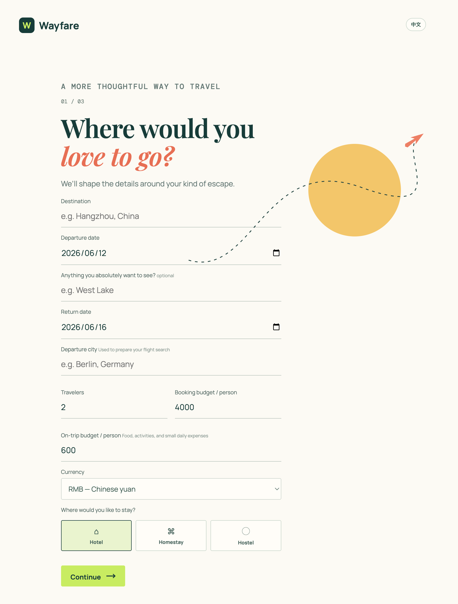
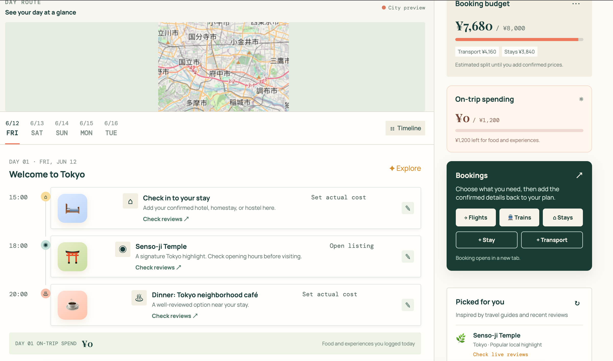
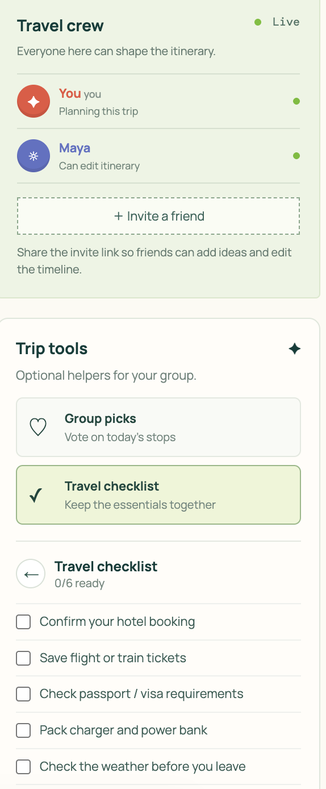

# Wayfare

> A collaborative travel copilot that turns a destination, dates, budget, and travel mood into an editable day-by-day itinerary.

**Live demo:** [wayfare-demo.vercel.app](https://wayfare-demo.vercel.app/)  
**Demo category:** Apps for Your Life

## Why Wayfare?

Travel planning is scattered across map tabs, booking sites, saved posts, and group chats. Wayfare brings the planning conversation into one calm, visual timeline: travelers can start with a few preferences, discover open-map places, account for confirmed transport and stays, and make the plan their own together.

## What it does

- Builds a multi-day itinerary from destination, dates, group size, budget, stay type, must-visit place, and trip style.
- Supports **Food first**, **Sightseeing**, and **Recharge** travel rhythms.
- Finds restaurants, cafés, cultural sites, parks, and stays using open geographic data—no paid Maps API or card required.
- Adapts the Day 1 stay recommendation to the traveler’s accommodation preference: hotel, homestay/guest house, or hostel.
- Prioritizes a must-visit stop and avoids repeating itinerary highlights where possible.
- Adds map-aware local travel suggestions and a lightweight OpenStreetMap route view.
- Lets travelers record confirmed hotel, flight, or train details; arrival/departure times automatically reshape the first and last day.
- Separates booking budget from in-trip spending and provides a gentle over-budget indicator rather than blocking choices.
- Includes editable timeline items, activity icons, avatars/color-coded contributors, restaurant voting, packing checklist, bilingual English/Chinese UI, and a mobile-friendly layout.
- Saves generated itineraries in a **My Trips** collection, so travelers can reopen, duplicate, delete, or start a separate timeline without overwriting an earlier trip.
- Exports the complete multi-day itinerary as one shareable PNG image for group chats or travel-day reference.

## A quick demo flow

1. Choose a destination, departure/return dates, travel style, group size, budgets, currency, and accommodation preference.
2. Add one non-negotiable place such as `West Lake`.
3. Build the trip and browse the generated daily timeline, recommendations, and map.
4. Use **+ Transport** to enter a confirmed arrival or departure ticket. The relevant day adjusts around the actual time.
5. Use **+ Stay** to add the booked hotel. Check-in and check-out stay compatible with confirmed transport.
6. Edit an event, add a friend avatar, vote between restaurant options, or track actual costs.
7. Select **My trips** to return to the trip collection, then open an earlier itinerary or plan a second one.
8. Choose **Export itinerary** to save every daily timeline in one shareable image.

## Screenshots and demo visuals

The following screenshots show the main product flow:








Screenshots are not required to run the project, but they make the product understandable before a judge presses play on the demo video.

## Tech stack

- Vanilla HTML, CSS, and JavaScript
- Vercel Serverless Functions
- OpenStreetMap, Nominatim, and Overpass API for open place data
- Leaflet for the lightweight map preview
- Browser `localStorage` for the prototype’s local editing, voting, and checklist state

## Architecture

```text
Browser UI
  ├─ onboarding + preferences
  ├─ editable timeline + budgets + group tools
  └─ Leaflet/OpenStreetMap map preview
          │
          ▼
Vercel /api/plan
  ├─ Nominatim: geocode destination / must-visit place
  └─ Overpass: restaurants, cafés, sights, parks, and stays
```

## Run locally

This is a dependency-light prototype.

1. Clone the repository.
2. Serve the project folder with any static-file server and open `index.html`.
3. To test itinerary generation, deploy to Vercel (the `/api/plan` endpoint is a Vercel serverless function).

### Deploy to Vercel

1. Import this GitHub repository into Vercel.
2. Keep the root directory as `./` and the preset as **Other**.
3. Deploy. No environment variables are required for the current open-data prototype.

`vercel.json` sets the itinerary API timeout to 10 seconds. The API also uses short request timeouts and the browser gracefully falls back to a location-aware demo itinerary if public map data is temporarily unavailable.

## Prototype today, product tomorrow

### What works in this prototype

The current hackathon demo uses open geographic data to generate a location-aware itinerary without requiring a paid API key. It links travelers out to booking and review partners, and supports local-browser group-planning interactions for a smooth demo.

### What Wayfare becomes with production integrations

- **Live transport and stays:** current flight, train, and hotel availability could be selected from live partner data and placed directly onto the timeline.
- **Review-aware recommendations:** restaurant, café, and attraction choices could be ranked from recent review sources and automatically fitted around the traveler’s time, budget, and hotel location.
- **Real shared planning:** an invite link could put friends into the same trip room, where they can join with a nickname/avatar, edit the timeline together, vote, and see changes in real time.

These are intentional next steps rather than claims about the current build. The interface and timeline model are already designed to make those integrations feel natural when the relevant APIs and real-time database are connected.

## Data and privacy notes

Wayfare’s current recommendations use shared public OpenStreetMap services, so this version is intended for a low-volume hackathon demo rather than production-scale traffic. The stay recommendation follows the requested accommodation category, but it is **not** a live Booking.com/OTA inventory result. Live fares, hotel availability, traffic, and review scores are deliberately linked out to booking/review partners instead of being represented as live data inside the app.

The collaboration experience and **My Trips** collection are currently a **local demo**: avatars, edits, votes, lists, and saved itineraries persist in the current browser only. A production version would use Supabase or Firebase for real-time rooms, authentication, and cross-device sync.

## How Codex and GPT-5.6 accelerated the build

Wayfare was built iteratively with Codex and GPT-5.6 as a product and engineering collaborator. They helped:

- translate a broad travel-planning concept into a focused hackathon scope and feature roadmap;
- design the onboarding flow, timeline interaction model, mobile layout, and bilingual interface;
- implement the Vercel API integration with Nominatim/Overpass and resilient fallback behavior;
- connect booking, hotel, budget, transport-time, map, voting, and checklist interactions into one coherent prototype;
- diagnose UI issues such as stale destination defaults, slow map requests, date/time conflicts, and budget-state feedback;
- turn continuous user testing feedback into small, shippable improvements.

The final product decisions—such as making budgets flexible, treating arrival and departure as timeline constraints, and keeping data sources open for a no-card demo—were made during that iterative collaboration.

## Future work

- Real-time shared trip rooms with Supabase/Firebase
- Live flight and hotel pricing through a managed provider such as Amadeus
- Better routing, traffic, and transit data
- Curated review/ranking providers with transparent source attribution
- Availability-aware booking handoff and alerts

## Submission checklist

- [x] Add the Vercel Production URL above.
- [ ] Add the public GitHub repository URL to Devpost (or grant Devpost testing access if the repository stays private).
- [ ] Record a public YouTube demo video under three minutes, including how Codex and GPT-5.6 were used.
- [ ] Add the Codex `/feedback` Session ID required by the submission form.
